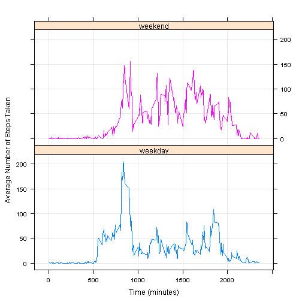

# Reproducible Research: Peer Assessment 1


## Loading and preprocessing the data


```r
data <- read.csv(unz("activity.zip", "activity.csv"))
```

## What is mean total number of steps taken per day?


```r
dates <- levels(data[, 2])

totalStepsOn <- function(specificDate,dataSheet){
    return(sum(dataSheet[which(dataSheet$date == specificDate), ]$steps))
}

totalSteps <- sapply(dates,totalStepsOn,dataSheet = data)

# With the above, we plot the total number of steps taken per day in a histogram:
hist(totalSteps, main = "Histogram of Total Number of Steps Taken Each Day", 
      xlab = "Total Number of Steps Taken")
```

 

```r
meanPerDay <- toString(round(mean(totalSteps, na.rm = TRUE), 1))
medianPerDay <- median(totalSteps, na.rm = TRUE)
```

The **mean** total number of steps taken each day is approximately **10766.2** and the **median** total number of steps taken each day is **10765**.

## What is the average daily activity pattern?

```r
times <- seq(0, max(data$interval), 5)

averageStepsFor <- function(time,dataSheet){
    return(mean(dataSheet[which(dataSheet$interval == time), ]$steps, na.rm = TRUE))
}

averageSteps <- sapply(as.character(times),averageStepsFor,dataSheet = data)

# With the above ,we plot the average number of steps taken with respect to time:
plot(times, averageSteps, type = "l", main = "Average Number of Steps Taken vs. Time", 
     xlab = "Time (minutes)", ylab = "Average Number of Steps Taken")
```

 

```r
maxNumberOfSteps <- as.integer(names(averageSteps)[which(averageSteps==max(averageSteps, na.rm = TRUE))])
```

The **interval** ranging from **835 minutes to 840 minutes** contains the maximum numbers of steps, on average across all the days in the dataset.

## Imputing missing values
We begin by calculating and reporting the total number of missing values in the dataset:


```r
numberOfMissingValues <- nrow(data[is.na(data$steps) == TRUE,])
```
The **total number of missing values** in the dataset is **2304**.

We consider the following **strategy for imputing missing data**: fill in the missing values for a 5-minute interval by replacing them with the median (over all non-missing values) for that 5-minute interval.

```r
data2 <- data

replaceMissingValues <- function(time){
    initialMedian <- median(data[which(data$interval == time), ]$steps, na.rm = TRUE)
    
    if(nrow(data2[(data2$interval == time) & (is.na(data2$steps) == TRUE),]) != 0){
        data2[(data2$interval == time) & (is.na(data2$steps) == TRUE),][,1]<<-initialMedian
    }
}

for(time in times) replaceMissingValues(time)

totalSteps2 <- sapply(dates,totalStepsOn,dataSheet = data2)

# With the above, we plot the total number of steps taken per day in a histogram (based on this new data set):
hist(totalSteps2, main = "Histogram of Total Number of Steps Taken Each Day", 
      xlab = "Total Number of Steps Taken", sub = "(after missing data has been imputed)")
```

 

```r
meanPerDay2 <- toString(round(mean(totalSteps2, na.rm = TRUE), 1))
medianPerDay2 <- median(totalSteps2, na.rm = TRUE)
```

After imputing the missing values, the **mean** total number of steps taken each day is approximately **9503.9** and the **median** total number of steps taken each day is **10395**.

These new values are **different** from the estimates made in the first part of the assignment. Both the mean and median total number of steps taken each day have **decreased** as a result of imputing missing data.

## Are there differences in activity patterns between weekdays and weekends?

```r
# We create a new factor variable for the new dataset with two levels - "weekend" (Saturday & Sunday) and "weekday" (Monday through Friday):
whichPartOfWeek <- function(stringDate){
    day <- weekdays(as.Date(stringDate), abbreviate = FALSE)
    ifelse((day == "Saturday") || (day == "Sunday"), 1, 0)
}
data2$partofweek <- sapply(data2$date,whichPartOfWeek)
data2$partofweek <- factor(data2$partofweek, labels = c("weekday", "weekend"))

# We use this new factor variable to form a panel plot comparing the average number of steps taken over all weekend days per 5-minute interval and the average number of steps taken over all weekday days per 5-minute interval:
averageSteps2weekend <- sapply(times,averageStepsFor,
    dataSheet = data2[which(data2$partofweek == "weekend"),])
averageSteps2weekday <- sapply(times,averageStepsFor,
    dataSheet = data2[which(data2$partofweek == "weekday"),])

data3 <- as.data.frame(rbind(cbind(times, averageSteps2weekend, 1), 
               cbind(times, averageSteps2weekday, 0)))
colnames(data3) <- c("interval", "averagesteps", "partofweek")
data3$partofweek <- factor(data3$partofweek, levels= c(0,1), labels = c("weekday", "weekend"))
# Some 5-minute intervals do not have any data. Since the assignment did not require that these values be imputed, we omit them from the data prior to graphing.
data3 <- na.omit(data3)

library(lattice)
xyplot(averagesteps~interval | partofweek, data = data3, group = partofweek, 
       grid = TRUE, type = "a", layout = c(1,2),
       xlab = "Time (minutes)", ylab = "Average Number of Steps Taken")
```

 

There appears to be a difference between the activity patterns between weekdays and weekends. In particular, the activity levels on weekdays around the 800-900 minute interval (around 200 steps) is noticeably higher than the activity levels on weekends around the 800-900 minute interval (around 150 steps). However, activity levels on weekends appear consistently higher around the 900-2000 minute interval (around 100 steps) compared to activity levels on weekdays (around 50 steps).
